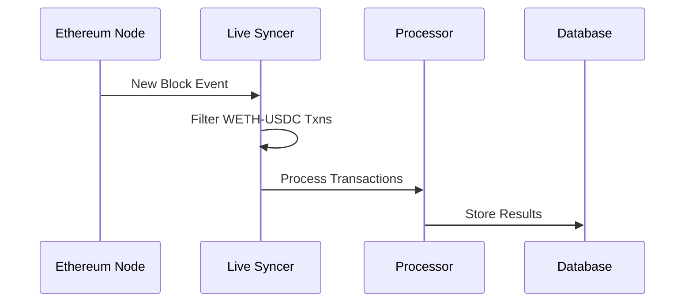
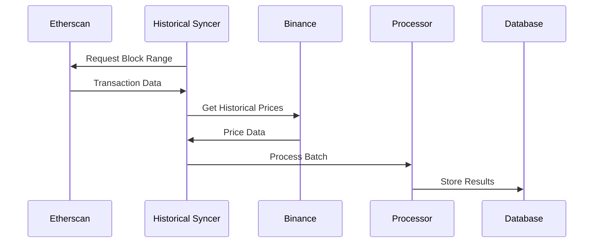

<div align="center">

# 🔄 Uniswap Fee Tracker

*A backend system that tracks transaction fees in USDT for Uniswap WETH-USDC transactions*

</div>

## 🚀 Quick Start

### Prerequisites
- Docker and Docker Compose
- Etherscan API Key
- Infura API Key

### 1. Clone & Setup
```bash
# Clone the repository
git clone https://github.com/Pujith-M/uniswap-fee-tracker.git
cd uniswap-fee-tracker

# Create environment file
cp .env.example .env
```

### 2. Configure Environment
Edit `.env` file with your API keys:
```env
# Required API Keys
ETHERSCAN_API_KEY=your_etherscan_api_key_here
INFURA_API_KEY=your_infura_api_key_here

# Optional Configurations
DB_URI=postgresql://pujithm:postgres@db:5432/uniswap-fee-tracker
```

### 3. Run the Application
```bash
# Build and start services
docker-compose up --build

# Run in background (optional)
docker-compose up -d --build

# View logs when running in background
docker-compose logs -f

# Stop services
docker-compose down
```

### 4. Try the API

Once the application is running, you can access the API in two ways:

1. 📚 **Using Swagger UI** (Recommended for Exploration)
   ```
   Visit: http://localhost:8080/swagger/index.html
   ```
   The Swagger UI provides:
   - Interactive documentation
   - One-click API testing
   - Request/response schemas
   - Example values

2. 🔌 **Direct API Calls**
   ```bash
   # Get transaction fee for a specific hash
   curl http://localhost:8080/api/v1/transactions/0x123...

   # Or use in browser
   http://localhost:8080/api/v1/transactions/{txHash}
   ```

3. 🔍 **Verify Services**
   - API Health Check: http://localhost:8080/health
   - PostgreSQL: localhost:5432
   - Swagger Docs: http://localhost:8080/swagger/index.html

4. 🧪 **Example Transaction Hash**
   ```
   0x8395927f2e5f97b2a31fd63063d12a51fa73438523305b5b30e7bec6afb26f48
   ```


### Key Components

🔹 **Live Syncer**
- Monitors new Ethereum blocks in real-time
- Filters WETH-USDC pool transactions
- Handles network interruptions with retry logic

🔹 **Historical Syncer**
- Batch processes past transactions
- Configurable date range processing
- Optimized for large data sets

🔹 **Transaction Processor**
- Calculates transaction fees in USDT
- Uses real-time/historical ETH prices
- Implements rate limiting for external APIs

## ✨ Features

<div align="center">

| Feature | Description |
|---------|-------------|
| ⚡ **Real-time Tracking** | Live monitoring of Uniswap WETH-USDC transactions |
| 📚 **Historical Data** | Batch processing of past transactions with configurable ranges |
| 🔌 **RESTful API** | Clean, well-documented endpoints for querying transaction data |
| 🚦 **Rate Limiting** | Smart throttling for external API calls |
| 🐳 **Docker Ready** | Full containerization with Docker and Docker Compose |
| 🧪 **Test Coverage** | Comprehensive test suite with TDD approach |

</div>

## 🛠 Tech Stack

<div align="center">

| Category | Technology |
|----------|------------|
| 💻 **Language** | Go 1.22 |
| 🗄️ **Database** | PostgreSQL 15 |
| 🌐 **Node Provider** | Infura |
| 📡 **Block Explorer** | Etherscan |
| 💱 **Price Data** | Binance |
| 🐳 **Infrastructure** | Docker & Docker Compose |

</div>

## 🔌 API Reference

### Get Transaction Fee

```http
GET /api/v1/transactions/:hash
```

#### Response

```json
{
    "hash": "0x123...",
    "block_number": 12345678,
    "timestamp": "2024-02-13T10:00:00Z",
    "fee_eth": "0.005",
    "fee_usdt": "10.50",
    "eth_price": "2100.00"
}
```

## 🔧 Technical Details

### Data Flow

#### 1. Live Sync Process


#### 2. Historical Sync Process


### Rate Limiting

| API | Rate Limit | Retry Strategy |
|-----|------------|----------------|
| Ethereum Node | 10 req/s | Exponential backoff |
| Etherscan | 5 req/s | Fixed interval |
| Binance | 20 req/s | Sliding window |

## 🧪 Testing

```bash
# Run all tests with verbose output
go test -v ./...

# Generate coverage report
go test -coverprofile=coverage.out ./...
go tool cover -html=coverage.out
```

## 📈 Monitoring

### Key Metrics
- Transaction Processing Rate
- API Response Times
- Error Rates
- Database Connection Status

### Health Checks
```bash
# Check API health
curl http://localhost:8080/health

# Check DB connection
docker-compose exec db pg_isready
```

## 🔄 Future Improvements

### Scalability
- [ ] Implement database sharding
- [ ] Add Redis caching layer
- [ ] Deploy with Kubernetes

### Features
- [ ] Decode Uniswap swap prices
- [ ] Add WebSocket support
- [ ] Implement API rate limiting
